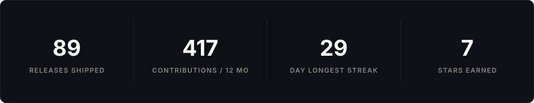
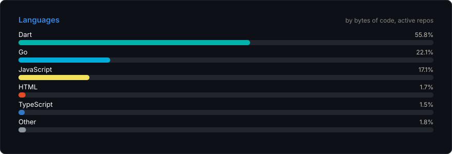
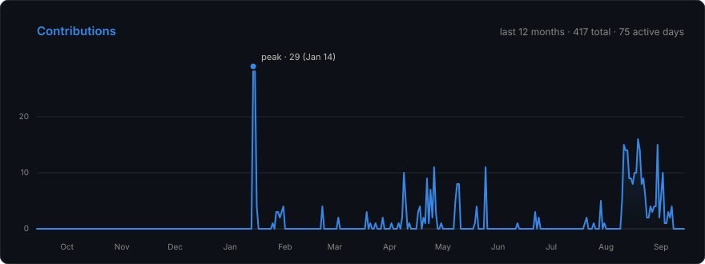

**Rookie wannabe dev 🤝** — I build Android-first AI apps and tooling, mostly written on a phone running Termux. If it can't run on Android, I rebuild it until it can.

## 🚀 What I've shipped

| Project | What it is | Stack |
|---|---|---|
| 📱 [**MaiChat**](https://github.com/Ansh99999/Maichat) | AI character chat for Android — SillyTavern-class customisation, one-thumb UI, no server | Flutter · 80 releases |
| 🎭 [**MaiTavern**](https://github.com/Ansh99999/maitavern) | mobile-first AI roleplay frontend — the customisation of SillyTavern, the ease of Agnaistic | TypeScript · Capacitor |
| 🔌 [**dsapi**](https://github.com/Ansh99999/dsapi) | DeepSeek web → OpenAI / Claude / Gemini-compatible API gateway | Go · React |
| 🛠️ [**claudecode-provider-extension**](https://github.com/Ansh99999/claudecode-provider-extension) | provider & API-key manager for Claude Code — switch base URLs, rotate keys round-robin | JavaScript |
| 🎮 [**Annihilation Arena**](https://github.com/Ansh99999/Top-down-anhilator) | multiplayer 2D vehicular arena shooter, optimised for mobile & Termux | Node.js |
| 🦆 [**clodproxy**](https://github.com/Ansh99999/clodproxy) | borrow a Claude subscription's auth for OpenAI-compatible API calls | Node.js |

## 🧰 Tech stack

## 📊 The numbers

## 📈 Contributions

## 🐍 Watch the snake eat my contributions

<picture>
  <source media="(prefers-color-scheme: dark)" srcset="https://raw.githubusercontent.com/Ansh99999/Ansh99999/output/snake-dark.svg" />
  
</picture>

